# Trabajo Práctico N°5: Device drivers

### Asignatura: Sistemas de Computación

**Facultad de Ciencias Exactas, Físicas y Naturales (UNC)**

---

* **Grupo:** Sudo Make A Sandwich
* **Profesores:** Miguel Angel Solinas y Javier Alejandro Jorge

---

### Integrantes y Contacto

| Nombre y Apellido | Correo Electrónico |
| :--- | :--- |
| **Sergio Andrés Fernández Segovia** | _sergio.fernandez.segovia@mi.unc.edu.ar_ |
| **Enzo Leonel Laura Surco** | _enzo.laura.surco@mi.unc.edu.ar_ |
| **Saqib Daniel Mohammad Cabrejos** | _saqib.mohammad@mi.unc.edu.ar_ |


# Desarrollo


Previamente al desarrollo de este trabajo practico se preparo el hardware que alojara nuestro modulo mediante una Raspberry Pi Zero 2w con Raspberry OS Lite (version solo terminal) de 64 bits flasheada en la micro SD. en donde nos conectaremos a su terminal mediante SSH desde nuestra computadora de Local o de usuario.


Este trabajo se decidio dividir en varias etapas primero 
se realizo una prueba general del sistema en donde compilamos el driver CDD con señales simuladas en donde aunque rompa un poca con la consigna en esta primera etapa sirve para verificar el correcto funcionamiento del modulo en el kernel (en la etapa final esta complejidad innecesaria desaparecera), el cual cargaremos en la Raspberry Pi y verificaremos primero mediante comandos terminal cat y echo. 

 Esta prueba se efectuo debido a que el metodo que se utilizo es uno muy usado en la produccion de sistemas embebidos llamado Cross Compilation, compilando el codigo fuente obteniendo el ejecutable en una computadora Local o de usuario y probandolo dentro de la arquitecura del procesador del embebido. Lo cual sino se hace de manera correcta puede llevar a multiples errores despues.

El archivo en cuestion se encuentra en el directorio c_scripts/prueba/ del repositorio y se llamara ```sdec_prueba.c```.


Una informacion importante para tener exito en Cross Compilation es saber aa arquitectura de nuestra Raspberry Pi la cual es de 64 bits.

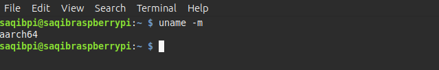


Para poder observar los valores que se exponen en los GPIO como pide la consigna, se decidio implementar un programa en python con interfaz web este se encargara de exponer la interfaz limpia /dev/SdeC_ la misma aplicacion correra en la Raspberry Pi leera el dispositov cada 1 segundo y actuara como el servidor web para mi PC anfitriona.


## Adentradonos en el codigo ```sdec_prueba.c```


Este codigo sera la base del modulo del kernel y del archivo CDD, en esta etapa como ya mencionamos agregamos una complejidad innecesaria pero es a modo de simulacion con valores mockup para asegurarnos que toda la estructura del driver funciona correctamente sin depender de ninguna señal externas ni arriesgandonos a bloqueos de hardware o dañando la misma placa.


Este código evoluciona el modelo de ```drv4.c```. En lugar de un buffer estático de un solo carácter , implementamos un estado global para seleccionar el canal (0 o 1) mediante la función write , y generamos dos señales simuladas matemáticamente dentro de read.


Utiliza la estructura de inicialización automática de tus archivos de referencia (drv3.c y drv4.c). Implementa las macros module_init() y module_exit() , reserva dinámicamente los números mayor y menor con alloc_chrdev_region() y genera el archivo en /dev usando class_create() y device_create().  


Como la tecnica a utilizar es Cross Compilation debemos configurar un Makefile especifico con los headers que usa el kernel de Raspberry PI OS.Una forma limpia y rapida es descargarlos en la Raspberry Pi y traerlos a nuestra computadora local.

Nos conectamos por SSH y ejecutamos lo siguiente (este paso se hace por las dudas ya que muy posiblemente ya tengo esos headers)

```
sudo apt update
sudo apt install linux-headers-$(uname -r)
```

Y verificamos donde se enceuntran esos archivos
```
ls -d /usr/src/linux-headers-*
```

En nuestra PC traemos esos headers mediante la terminal y de manera local ejecutando

```
mkdir -p ~/rpi_kernel


scp -F /dev/null -r saqibpi@192.168.43.252:/usr/src/linux-headers-6.12.75+rpt-* ~/rpi_kernel/
```
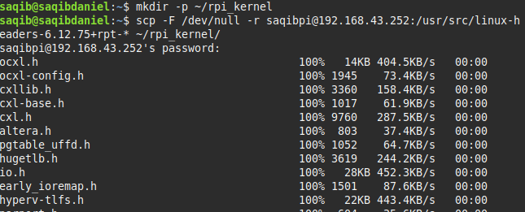


Ahora con los archivos header necesarios ya de manera local configuraremos nuestro Makefile  que sirven para compilar los codigos fuente de los ```drivers.c``` 

```
obj-m += sdec_prueba.o

# Apunta directo al directorio v8 de home local, donde se encuentran los headers del kernel para Raspberry Pi
KDIR := $(HOME)/rpi_kernel/linux-headers-6.12.75+rpt-rpi-v8

ARCH := arm64
CROSS_COMPILE := aarch64-linux-gnu-

all:
	make -C $(KDIR) M=$(shell pwd) ARCH=$(ARCH) CROSS_COMPILE=$(CROSS_COMPILE) modules

clean:
	make -C $(KDIR) M=$(shell pwd) clean
```

Este Makefile tomara el codigo fuente que inicialmente usaremos de prueba lo compilara en un .o y luego generara un modulo final .ko. Ademas definimos la ruta donde se encuentran los headers del kernel de la Raspberry Pi. Le indicamos que la arquitectiura de destino es una ARM de 64 bits. Y definimos el prefijo de las herramientas de compilacion cruzada. El Makefile y buscara otros comandos en lugar de usar el compilador nativo de mi computadora ```gcc```.

Tambien tenemos una regla ```make``` y una ```clean```, ```make```  cambiara el directorio que se definio para compilar con headers correctos. Los codigos fuente estan en el directorio actual. ```clean``` sirve para limpiar el espacio de trabajo, eliminando todos lo archivos generados durante la compilacion dejando solo el codigo fuente.


Entonces ejecutamos el comando ```make``` lo cual nos generara el archivo ```.ko``` esto lo enviamos mediante ```scp``` al directorio /home de la Raspberry Pi.

```
scp -F /dev/null sdec_prueba.ko saqibpi@192.168.43.252:/home/saqibpi/
```

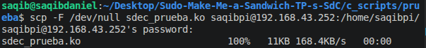

Cargamos el modulo con:

```
sudo insmod sdec_prueba.ko
```

Y comprobamos que el modulo fue cargado correctamente:

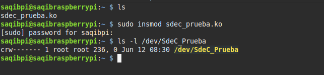

Notamos que en los permisos empieza con C, lo que confirma que es un Character Device. Ademas notamos como el sistema le agrego el numero major 236 y el minor 0.

Ademas para permitir la lectura de ese driver tenemos que modificar los permisos mediante:

```
sudo chmod 666 /dev/SdeC_Prueba
```

Entonces haremos unas ruebas sobre el modulo para garantizar su funcionamiento; al ejecutar el comando ```cat``` el kernel traduce la peticion del usuario e invoca a la funcion de abstraccion llamada ```my_read()```.

Como el driver de prueba inicia por defecto en el Canal 0 el codigo devuelve una cadena de texto basada en la constante 100 sumada a una variable global llamada ```contador_clicks```. cada llamada a ```cat``` incrementa dicho contador y el ```copy_to_user()``` lo envia correctamente al espacio de usuario.

El comando ```echo -n"1"``` envia un byte de informacion hacia el dispositiva, el VFS entonces invocara a la funcion ```my_write()``` del driver, quien envia al espacio de usuario con ```copy_from_user()```, al detectar el caracter '1' conmuta inmediatamente debido a la variable de estado llamada ```canal_seleccionado = 1```; y salta  a una base para el canal 1 (constante 500) entregando el valor 502. 

En otras palabras le indicamos al CDD que señal leer.

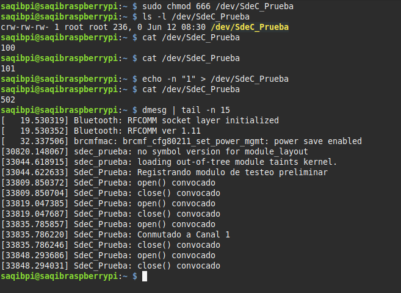


Se creo tambien un codigo en python llamado en ```app.py```

Este codigo actua como un puente entre el CDD/CDF y el usuario, crea y aloja una interfaz web interactiva con un grafico en tiempo real.
Cada 1 segundo, lee los datos generados por el controlador del kernel desde el archivo del dispositvo
en /dev/ y se los envia al grafico web. Ademas recibe las ordenes del usuario cuando se clickea en los botones de la web escribiendo un '0' o un '1' para indicarle al controlador del kernel que datos queremos.
Finalmente levantamos el servidor en el puerto 5000 permitiendo que cualquier dispositvo en la misma red Wifi pueda ver el panel ingresando en la IP de Raspberry Pi.


Una vez hecho esto lo enviamos a la Raspberry Pi mediante el comando: 

```
scp -F /dev/null app.py saqibpi@192.168.43.252:/home/saqibpi/
```

Y desplegamos la app mediante el comando ```python3 app.py```

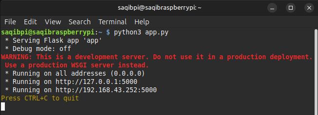


En nuestra computadora podemos visualizar la UI poniendo en el buscador la IP:PUERTO de la Raspberry PI en la red.

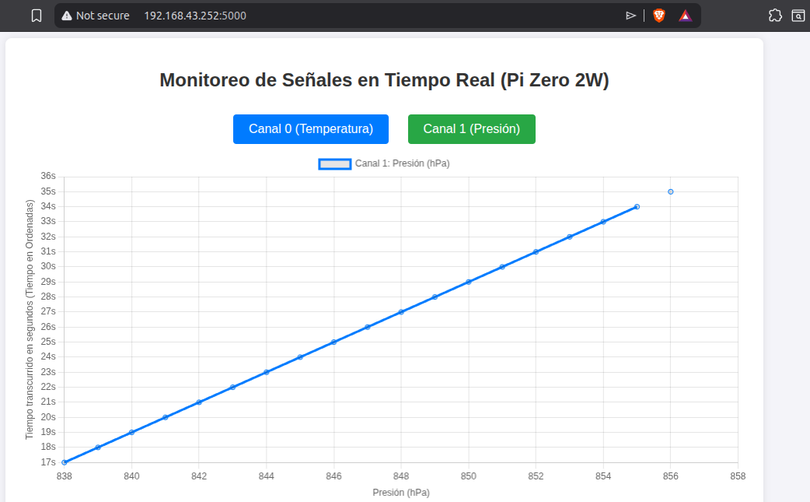

*** **Nota:** La app.py esta sujeta a modificacion las señales pueden ser otras aparte de temperatura y presion ademas son señales simuladas. ***


## Implementacion de Señales de Sensores mediante ESP32 -> Raspberry PI

La ESP32 genera dos señales digitales distintas (frecuencias o estados) en dos de sus pines.

Esos pines se conectan directo a dos pines GPIO de la Raspberry Pi.

Modificamos el driver en C (sdec_prueba.c) para que use las funciones del kernel <linux/gpio.h> y lea el estado físico de esos pines según el canal que le pida Flask.

La ESP32 generara dos señales digitales distintas (frecuencias o estados) en sus dos pines, esos pines se conectan directo a dos pines GPIO de la Raspberry Pi 
Modificaremos nuestro driver en C, para que use funciones del kernel ```<linux/gpio.h>``` y lea el estado fisico de esos pines segun el canal que le pida nuestra app en Flask.


### Conexion fisica que se realizara:

**1. El conexionado físico (Hardware):**

Como ambas placas manejan 3.3V, la conexión es segura y directa. Vamos a elegir dos pines GPIO estándar de la Raspberry Pi (por ejemplo, el 23 y el 24).

| ESP32 (Salida) | Dirección | Raspberry Pi (Entrada) | Rol en el TP |
| :--- | :---: | :--- | :--- |
| GND | <---> | GND (Pin 6) | Masa común obligatoria |
| GPIO 18 | ----> | GPIO 23 (Pin 16) | Señal Externa 0 (Temperatura) |
| GPIO 19 | ----> | GPIO 24 (Pin 18) | Señal Externa 1 (Presión) |

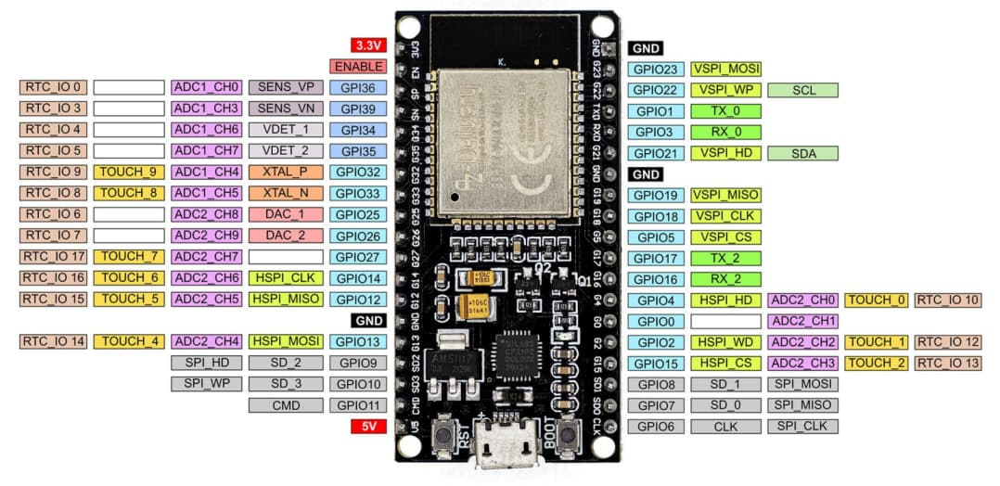


**2. Crearemos un nuevo archivo en nuestro directorio /driver_gpio**

Nuestro nuevo archivo ```sdec_driver_gpio.c``` el cual sera nuestro nuevo CDD que incluira la API de GPIO del kernel de Linux

```
#include <linux/gpio.h> // API de GPIO del Kernel
```

Incluimos los pines de la Raspberry PI

```
#define GPIO_SEÑAL_0 535  // (512 de base + 23 del GPIO)
#define GPIO_SEÑAL_1 536  // (512 de base + 24 del GPIO)
```

Solicitaremos al kernel el control de los pines fisicos en la funcion prueba_init():

```
gpio_request(GPIO_SEÑAL_0, "SdeC_Sig0");
gpio_direction_input(GPIO_SEÑAL_0);

gpio_request(GPIO_SEÑAL_1, "SdeC_Sig1");
gpio_direction_input(GPIO_SEÑAL_1);
```

Hacemos una modificacion parecido en prueba_exit() liberando los pines con gpio_free()

Finalmente tambien modificaremos la funcion my_read()

```
static ssize_t my_read(struct file *f, char __user *buf, size_t len, loff_t *off) {
    char mensaje_usuario[8];
    int longitud_msg;
    int estado_pin;

    if (*off > 0) return 0; // EOF

    // LEER HARDWARE CRUDO: El driver solo captura el bit físico (0 o 1)
    if (canal_seleccionado == 0) {
        estado_pin = gpio_get_value(GPIO_SEÑAL_0);
    } else {
        estado_pin = gpio_get_value(GPIO_SEÑAL_1);
    }

    // Enviamos el bit crudo ("0\n" o "1\n") al espacio de usuario
    longitud_msg = snprintf(mensaje_usuario, sizeof(mensaje_usuario), "%d\n", estado_pin);

    if (copy_to_user(buf, mensaje_usuario, longitud_msg) != 0) return -EFAULT;

    *off += longitud_msg;
    return longitud_msg; 
}
```


Con esta arquitectura, cuando se cambie el canal en la pagina web Flask escribira un '0' o un '1' al driver, el driver conmutara su lectura hacia el pin GPIO correspondiente, mediendo el voltaje real que le manda la ESP32, la UI leera ese valor de pin ese momento y lo mostrara a traves de la interfaz web. Esta es toda la complejidad que queremos que maneje el archivo CDF todo lo demas como el escalado o alguna otra operacion matematica es transladada a la app en python.


***Makefile***: Modificaremos nuestro archivo coincidiendo con el nombre del nuevo codigo fuente: ```obj-m += sdec_driver_gpio.o``` y compilamos.

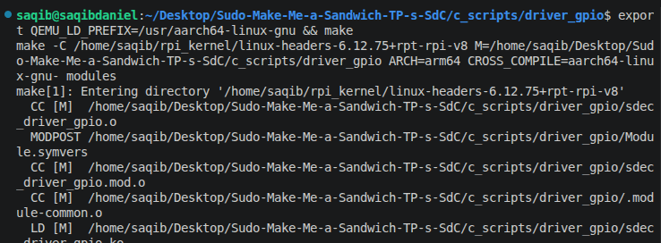

Enviamos el archivo compilado: ```sdec_driver_gpio``` y la aplicacion ```app.py``` actualizada

```
scp -F /dev/null sdec_driver_gpio.ko saqibpi@192.168.43.252:/home/saqibpi/

scp -F /dev/null app.py saqibpi@192.168.43.252:/home/saqibpi/

```
Repetimos el mismo procedimiento removeremos el antiguo driver y cargaremos el nuevo y modificamos los permisos.

Dentro de la Raspberry Pi
```

sudo rmmod sdec_prueba

# Insertamos el nuevo driver que lee los GPIOs
sudo insmod sdec_driver_gpio.ko

# Le damos permisos globales al nuevo nodo automático
sudo chmod 666 /dev/SdeC_SudoMakeMe
```
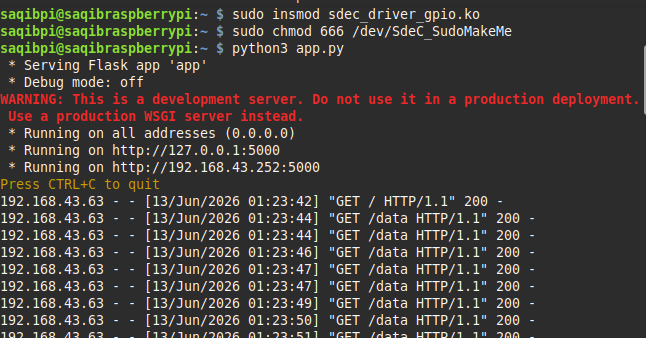

Podemos observar como la configuracion nueva funciona. Conectaremos y cargaremos nuestro codigo en ESP32 se encuentra en nuestro directorio raiz con el nombre ```esp32.c```.

```
void loop() {
  unsigned long tiempoActual = millis();

  // Señal 0 (Temperatura): Cambia de estado en tiempos aleatorios (ej. 0.5s a 3s)
  if (tiempoActual - ultimoCambio0 >= intervalo0) {
    estado0 = !estado0;
    digitalWrite(pinSignal0, estado0);
    ultimoCambio0 = tiempoActual;
    intervalo0 = random(500, 3000); // Genera el próximo intervalo aleatorio
  }
  
  // Señal 1 (Presión): Cambia de estado en tiempos aleatorios (ej. 1s a 6s)
  if (tiempoActual - ultimoCambio1 >= intervalo1) {
    estado1 = !estado1;
    digitalWrite(pinSignal1, estado1);
    ultimoCambio1 = tiempoActual;
    intervalo1 = random(1000, 6000); // Genera el próximo intervalo aleatorio
  }
}
```

El programa de la ESP32 genera señales aleatorias; envía constantemente señales digitales (encendido=1 o apagado=0) por los pines GPIO 18 y 19, pero cambia sus estados en intervalos de tiempo impredecibles.
El pin 18 (Temperatura) cambia de estado aleatoriamente entre cada 0.5 y 3 segundos.
El pin 19 (Presión) cambia de estado aleatoriamente entre cada 1 y 6 segundos.


Finalmente levantaremos la app.py y conectaremos los pines fisicos como describimos anteoriormente y estamos listos para mostrar nuestro sistema de telemetria in real-time:

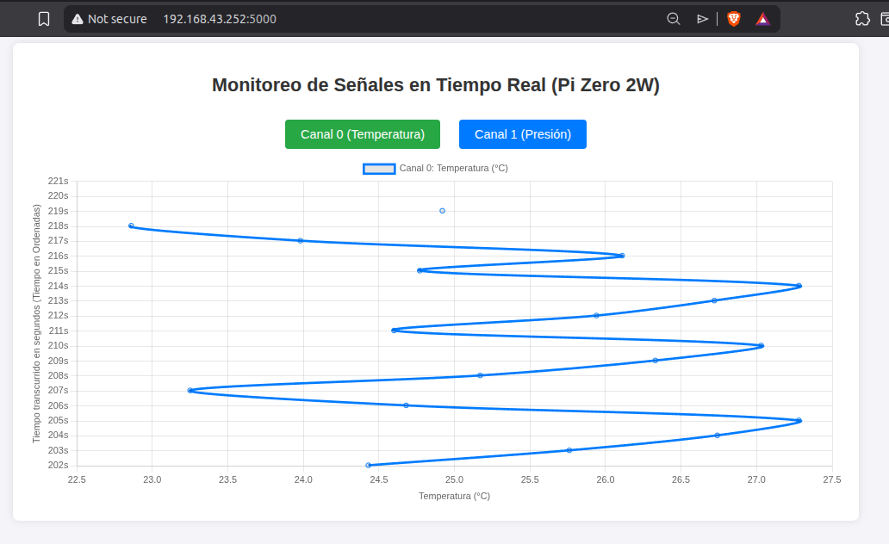
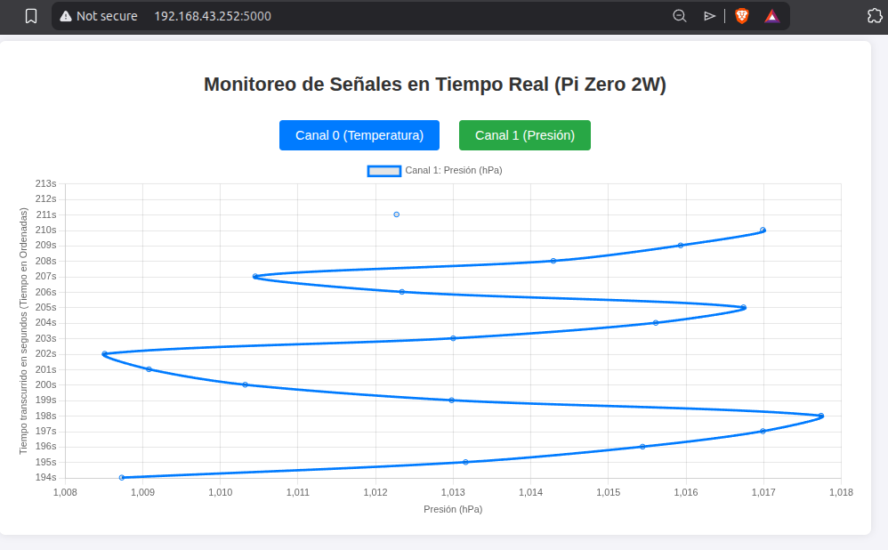

